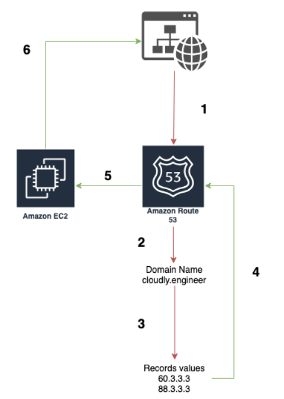
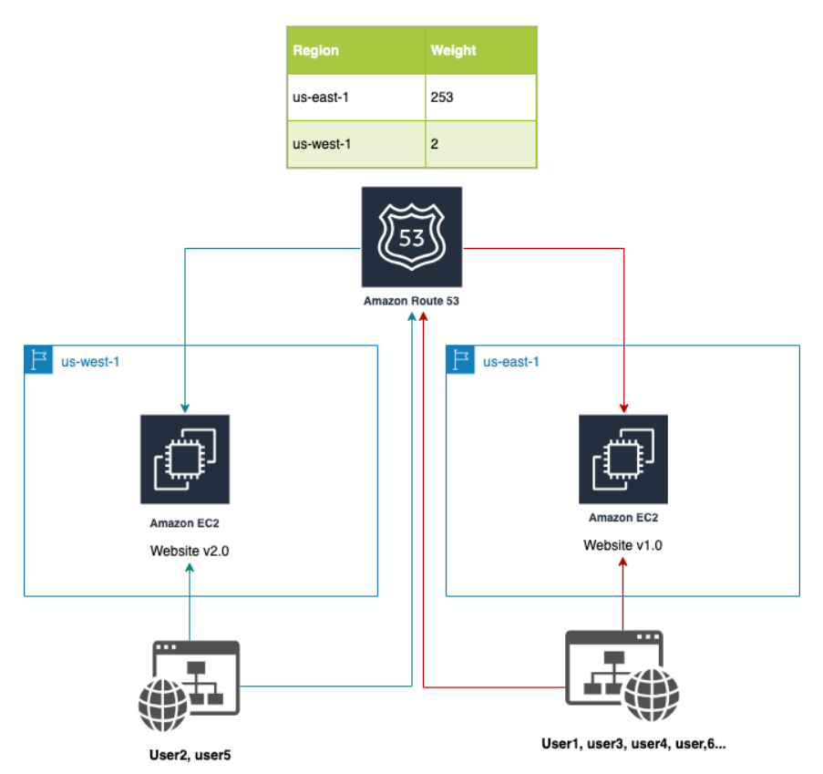
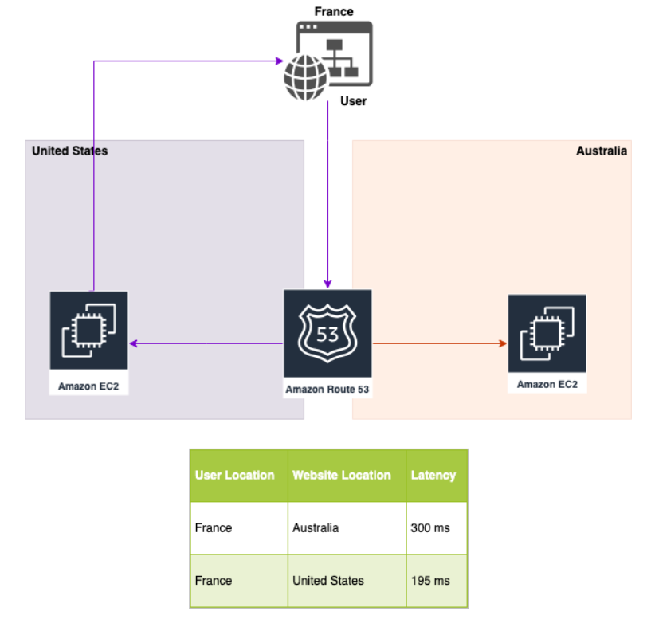
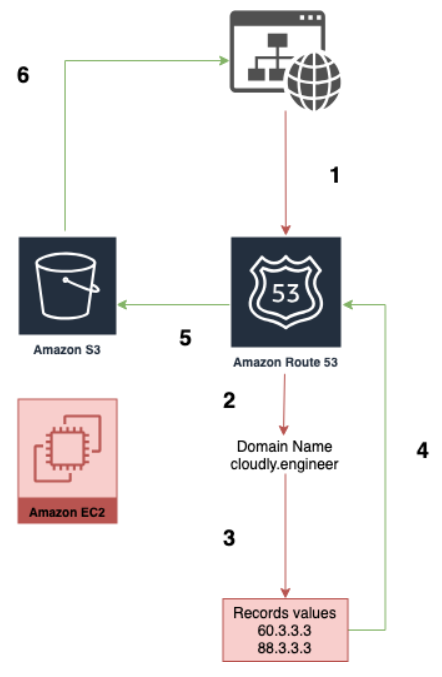
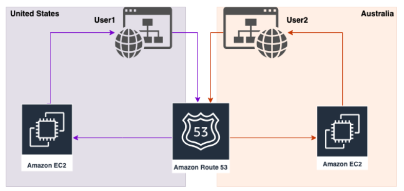
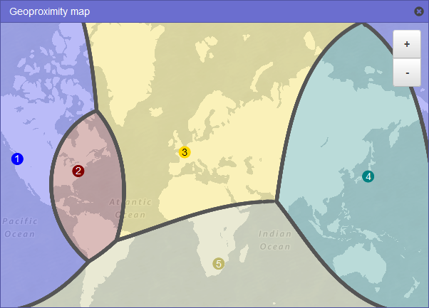
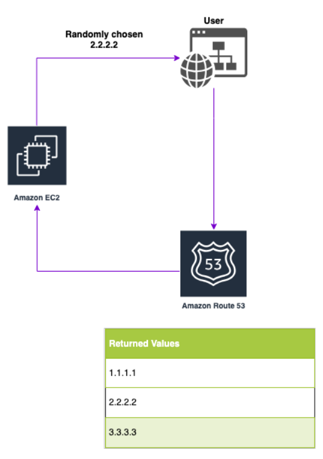

AWS - Route 53 : Managed DNS
-----------------------------------------------------------------------------------------------------------------------------------------------------------
Useful URL: https://cloudly.engineer/2019/aws-route-53-routing-policies-explained-with-diagrams/aws/

Route53 is a managed DNS (Domain Name System). A DNS is a collection of rules and records, which helps clients to understand how to reach a server through 
its domain name.

-----------------------------------------------------------------------------------------------------------------------------------------------------------
    In AWS: The most comman records as 
    a.  'A' record: Hostname to IPV4
    b.  'AAAA' record:  Hostname to IPV6
    c.  'CNAME' record: Hostname to Hostname
    d.  'Alias' record: hostname to AWS resource

    Route 53 can use:
        a.  public domain names you own (or buy)
        b.  private domain names that can be resolved by your instances in your VPCs

    Features:
        a.  Load Balancing [Through DNS : Also called client load balancing]
        b.  Health Checks [limited]
        c.  Routing Policy: [simple; failover; geolocation; latency; weighted; multi value]

    Cost:
        $0.50 per month per hosted zone

-----------------------------------------------------------------------------------------------------------------------------------------------------------

Q01: How to navigate to Route 53?
-----------------------------------------------------------------------------------------------------------------------------------------------------------    
On the AWS management console, search for 'Route 53' and you will be able to navigate to Route 53 dashboard.

-----------------------------------------------------------------------------------------------------------------------------------------------------------

Q02: Can you purchase a domain directly from Route 53?
-----------------------------------------------------------------------------------------------------------------------------------------------------------
    Yes, we can purchase a domain directly from Route 53. Following are the steps:
        a.  On the Route 53 Dashboard, under the left vertical menu, click on 'Registered domains' under 'Domains'
        b.  Click on 'Register domain'
        c.  Next screen is - 'Choose a domain name', search a domain name of your choice to check its availability and the price.
        d.  Then 'Add to Cart' and click on 'buy' for one year
        e.  Provide your contact details and update your privacy options.

-----------------------------------------------------------------------------------------------------------------------------------------------------------

Q03: Is the 'Hosted Zone' created automatically, if you buy a domain from Route 53 dashboard?
-----------------------------------------------------------------------------------------------------------------------------------------------------------
Yes, a 'Hosted Zone' is created automatically, if we buy a domain from the Route 53 dashboard.

-----------------------------------------------------------------------------------------------------------------------------------------------------------

Q04: How to create a record set in the hosted zone?
-----------------------------------------------------------------------------------------------------------------------------------------------------------
    Once you have a registered domain, On the left vertical menu, click on 'Hosted Zone'
        a.  To create a new record set, 'Click on Record Set'
            1.  Provide a Name for the recrd set
            2.  Select the type of record ('A' or 'AAAA', 'CNAME' , 'Alias')
            3.  Define Time to Live (TTL) (multiple options in seconds, minutes, hours and day)
            4.  Provide the value based on the record type [for 'A' record, it will be an ipv4 address]
            5.  From the 'Routing Policy' select 'Simple'
            6.  Click on 'Create'

-----------------------------------------------------------------------------------------------------------------------------------------------------------
    
Q05: How to verify if the DNS record created in Route 53, actually works?
-----------------------------------------------------------------------------------------------------------------------------------------------------------
    Their are two ways to verify if the DNS record created in Route 53 works:
        a.  If the record set created was of type 'A', it means the record set will have an IPV4 address.
            1.  Simply search for the host on the browser and check on browser console logs to see the resolving IP address
                for e.g.: myfirstrecord.ashishsamarth.com
        b.  Another way to verify is to perform an nslookup / dig for the same host via Linux / Mac Terminal, and the terminal should 
            return the same ipv4 address.

-----------------------------------------------------------------------------------------------------------------------------------------------------------

Q06: What is DNS records - TTL (Time to Live)?
-----------------------------------------------------------------------------------------------------------------------------------------------------------
When you look for a URL address based on a hostname, the browser talks to the DNS asking for the IP Address to connect to. Since this is a 'Hostname' to 'IP' request, its eventually 'A' record. When the DNS responds with the 'A' record, it sends the browser two items, the first is the 'IP' address of the host and another parameter is 'TTL' (Time to Live), this TTL has an expiration value (in seconds/ mins/ hours / a day). This means, that the browser can save the IP address in its cache for the TTL value. Now if another tab on the browser, looks for the same 'Hostname' it will not call the
DNS, it will look inside its own cache first (if TTL has not expired) to get the 'IP'.

    Special Note:
        a. TTL is a mandatory parameter for each DNS record
        b. Having a HIGH TTL Value means:
            1.  Less traffic on DNS for querying the IP address based on supported parameters
            2.  Possibly outdated records in the client browser, in case the records in DNS was updated before the TTL expiration
        c. Having a LOW TTL value means:
            1.  High traffic on DNS for querying the IP Address based on supported parameters
            2.  Records in Client Browser Cache will be outdated for less duration
            3.  Newly updated records in DNS, will be propogated quickly to client browsers.

-----------------------------------------------------------------------------------------------------------------------------------------------------------

Q07: What is the difference in CNAME vs ALIAS?
-----------------------------------------------------------------------------------------------------------------------------------------------------------
    Following are the details:
        a.  CNAME: CNAME is used when you want to point a hostname to any other hostname:
            Consider an example where you are using some AWS resource (Load Balancer or Cloud Front), these resources expose an 
            AWS hostname in the URL 'Ib1-1234.us-east-2.elb.amazonaws.com' and you want to point this to 'apex.ashishsamarth.com'. 
            This is possible with a 'CNAME' record.
            
            CNAME record ONLY works for a NON-ROOT-Domain.

            What is a Non-Root Domain   :  'apex.ashishsamarth.com' is an example
            What is a Root Domain       :   'ashishsamarth.com' is an example.
        
        b.  ALIAS: Alias is used when you want to point an AWS resource
            Consider an example where you want to point your hostname to an AWS resource 
            ('apex.ashishsamarth.com' --> 'Ib1-1234.us-east-2.elb.amazonaws.com' )

            Advantage with ALIAS are: 
            1.  It works for both the Root Domain and the Non-Root Domain
            2.  Its Free
            3.  Supports Native Health Check

-----------------------------------------------------------------------------------------------------------------------------------------------------------

Q08: Explain Route 53: Simple Routing Policy?
-----------------------------------------------------------------------------------------------------------------------------------------------------------
Suppose on a web-browser you are looking for a hostname 'apex.ashishsamarth.com', this query goes to the DNS (Route 53) and the DNS responds back with the 'A' record (IP Address, along with the TTL). 'Simple' Routing policy is usually used to redirect to a single resource, but can also be used to redirect to multiple resources (more than 1 IP address). In case of multiple IP addresses in the 'Simple' Routing policy, the DNS will return one record for the TTL expiration and may or may not return the other configured IP address.So at a high level, this may seem like a 'Client Side Load Balancing' (since browser is asking for IP based on every refresh), but not very reliable.
        
Special Note: 'Simple Routing Policy' does NOT support 'HEALTH CHECKS'

-----------------------------------------------------------------------------------------------------------------------------------------------------------

Q09: Explain Route 53: Weighted Routing Policy?
Weighted Routing Policy, controls the '%' of the requests that go to a specific endpoint. Consider the following example:

Suppose you have Route 53 and you have created a weighted policy, to redirect traffic to 3 EC2 instances, but since all the EC2 instances are not of the same specification, you want to balance the routing based on their specifications.Higher specification instances gets more traffic, while lower specification instances gets less traffic. To deal with this scenario, weighted routing policy can help to send 70% of traffic to the 1st EC2 instance, 20% traffic to 2nd EC2 instance and 10% traffic to 3rd EC2 instance. 
    
This is again impacted by the TTL, meaning if the first time the DNS responded back with the IP to the browser it received the IP address of 1st EC2 instances, now when the TTL expires, their is a 70% chance that the DNS will respond back with the IP address of the 1st EC2 instance, while 20% for 2nd and 10% for 3rd EC2 instance, so the browser will send the traffic in the same manner.

    Special Note:
        1.  This routing policy is helpful to split traffic between two different regions alltogether depending on where the 
            Target is located.
        2.  'Weighted Routing Policy' supports 'HEALTH CHECKS'
        
    In Practicality:
        You have to set up 3 (1 for 70% and target EC2, another for 20% and target EC2 and so on) different 'A' records in 
        Route 53 with Weighted Policy.

-----------------------------------------------------------------------------------------------------------------------------------------------------------
    
Q10: Explain Route 53: Latency Routing Policy?
-----------------------------------------------------------------------------------------------------------------------------------------------------------
Latency Routing Policy, is the one of the most useful routing policy, because it re-directs the user to the server that has the least latency close to us. This policy is very helpful when, Latency of Users is a priority. 

    Special Note:
    1.  Latency is evaluated on the terms of 'USER TO DESIGNATED AWS REGION'
        e.g.:   Users in Germany may be re-directed to the US Region (if thats the lowest latency)

-----------------------------------------------------------------------------------------------------------------------------------------------------------

Q11: Explain HEALTH CHECKS in Route 53?
-----------------------------------------------------------------------------------------------------------------------------------------------------------
    HEALTH CHECK in Route 53 is similar to ELB, where if an instance is deemed unhealthy, Route 53 will not send any traffic to that 
    particular instance.
    
        Following is the Frequency of HEALTH CHECKS in Route 53:
        a.  An instance is deemed UN-Healthy if it fails 'x' number of health checks in a row, by default x=3
        b.  An instance is deemed Healthy if it passes 'x' number of health checks in a row, by default x=3
        c.  Default Health Check Interval = 30 seconds, can also be modified to 10 seconds, but it will increase the cost.
        d.  HEALTH CHECKS can be performed on HTTP, TCP and HTTPS

        Special Note:
        1.  Health Checks can be linked to Route 53 DNS queries.

-----------------------------------------------------------------------------------------------------------------------------------------------------------
    
Q12: Explain Route 53: Failover Routing Policy?
-----------------------------------------------------------------------------------------------------------------------------------------------------------
Consider an example where you have two EC2 instances, the first EC2 instance is primary and the second EC2 instance is secondary. By default, when a web-browser requests a DNS query to Route 53, based on the 'Failover Routing Policy' Route 53 will respond back with the 1st EC2 instance, until the primary EC2 instance is healthy. The moment 'Health Check' fails for the primary EC2 instance, the DNS will replace the 'A' record to be sent to the Web-Browser on the next DNS query with the IPv4 address of the 2nd EC2 instance. The failover from the Primary Instance to the Secondary instance, happens based on the 'HEALTH CHECK' of the instance.

Special Note: HEALTH CHECK is mandatory (for the Primary Instance) for this routing policy.

-----------------------------------------------------------------------------------------------------------------------------------------------------------

Q13: Explain Route 53: Geo Location Routing Policy?
-----------------------------------------------------------------------------------------------------------------------------------------------------------
This policy routes the traffic based on the USER location. Consider an example where the end user is location in UK, and we have an EC2 instance in France, then using this policy, we can redirect traffic from all users located in UK to be sent over to the EC2 instance in France. Along with this we need to also create a default policy, where any body in location other than UK, should be re-directed to a different location in AWS region.

-----------------------------------------------------------------------------------------------------------------------------------------------------------

Q14: Explain Route 53: Geo-Proximity Routing Policy?
-----------------------------------------------------------------------------------------------------------------------------------------------------------
This policy routes the traffic based on
    1.  User geographic location
    2.  AWS resources geographic location, closer to user.

Consider the following example:

Their are 4 users (1st in Washington, 2nd in Idaho, 3rd in Chicago, 4rh in Newyork), and 2 regions (1st in California, 2nd in Atlanta). Now with usual 'Geo-Proximity Routing' the first two users will be wouted to California region, and the remaing two users will be routed to Atlanta region.
In this policy, their is a special parameter called 'Bias', this parameter allows to shift the balance of traffic based on +ve and -ve values.
If you want more traffic to be handled by a region, give it a positive bias value (between 1 and 99), when you want less traffic to be sent over to a region, give it a negative bias value (between -1 to -99).

Now if we give a +ve bias value (e.g. 50) to the Geo-Proximity policy for resource in Atlanta region then 3 out of 4 users will be routed to the Atlanta region and the remaining 1 will be routed to California region.

    Resources Can be:
        1.  AWS resources (specify the AWS region)
        2.  Non-AWS resource (On-Premise DC: Specify Latitude and Longitude values)

-----------------------------------------------------------------------------------------------------------------------------------------------------------

Q15: Explain Route 53: Multi Value Routing Policy?
-----------------------------------------------------------------------------------------------------------------------------------------------------------
Multivalue answer routing lets you configure Amazon Route 53 to return multiple values, such as IP addresses for your web servers, in response to DNS queries. You can specify multiple values for almost any record, but multivalue answer routing also lets you check the health of each resource, so Route 53 returns only values for healthy resources. It's not a substitute for a load balancer, but the ability to return multiple health-checkable IP addresses is a way to use DNS to improve availability and load balancing. To route traffic approximately randomly to multiple resources, such as web servers, you create one multivalue answer record for each resource and, optionally, associate a Route 53 health check with each record. Route 53 responds to DNS queries with up to eight healthy records and gives different answers to different DNS resolvers. If a web server becomes unavailable after a resolver caches a response, client software can try another IP address in the response.

    Special Note:
        1.  If you associate a health check with a multivalue answer record, Route 53 responds to DNS queries with the corresponding IP 
            address only when the health check is healthy.
        2.  If you don't associate a health check with a multivalue answer record, Route 53 always considers the record to be healthy.
        3.  If you have eight or fewer healthy records, Route 53 responds to all DNS queries with all the healthy records.
        4.  When all records are unhealthy, Route 53 responds to DNS queries with up to eight unhealthy records.

