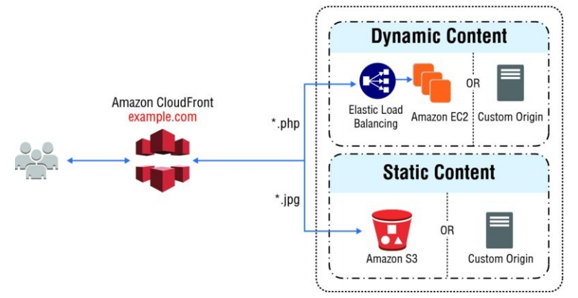

AWS - CloudFront
----------------------------------------------------------------------------------------------------------------------------------------

----------------------------------------------------------------------------------------------------------------------------------------
AWS CloudFront is a globally-distributed network offered by Amazon Web Services, which securely transfers content such as software, SDKs, videos, etc., to the clients, with high transfer speed. Its a content delivery network, and improves read performance since content is cached at the edge locations.
This also provides the following

----------------------------------------------------------------------------------------------------------------------------------------
    a.  DDoS Protection
    b.  Integration with Shield
    c.  AWS Web application firewalld
    d.  Provides a way to front your applications when you deploy applications globally
    e.  Allows you to expose HTTPS and can talk to Internal HTTPS backends, by loading the certificates.
----------------------------------------------------------------------------------------------------------------------------------------
Consider the following example:
Say we have an S3 bucket in Australia, and a user in USA wants to access it. So the User in USA will access an edge location close to it (in USA) and then the edge location network will be trasmitted all the way to the S3 bucket in Australia via a 'Private Link' and the content will be cached.The idea of caching here is, if their are more users in USA who want the same content, then the cached content will be available to them very quickly and the content will be delivered to them directly from USA. Similarly a user in any other geography will have the same experience, since the content will be made available to the user(s) closest edge location.

This basically allows the content to be read from all around the world, improves a lot on the latency and reduces the load on your S3 bucket.

Q01: What are different CloudFront: Origins?
----------------------------------------------------------------------------------------------------------------------------------------
Following is the list

    a.  S3 Bucket:  CloudFront in front of S3 bucket (very common pattern)
        1.  For distributing files and caching them at the edge
        2.  Enhanced Security with CloudFront : Origin Access Identity
            i.  OAI : Allows communication to S3 only from CloudFront and from nowhere else
        3.  CloudFront can be used as an Ingress (to Upload Files to S3)
        
    b.  Custom Origin (HTTP:)   :
        1.  Can be an Application Load Balancer
        2.  EC2 instance
        3.  S3 website (* Must enable the S3 bucket as a static S3 Website)
        4.  Any HTTP backend you want {For e.g.: It can be any HTTP backend even from your own premise}

Q02: Explain how CloudFront works?
----------------------------------------------------------------------------------------------------------------------------------------
We have a bunch of edge locations all around the globe and they are connected to an origin (can be any origins mentioned above) 
and the clients wants to access our CloudFront distribution. For this the  client will send a 'HTTP Request' (Their will be a URL with some query string parameters, some hearders) directly to CloudFront. The Cloud front will send this request with the headers to the origin (can be any origins mentioned above). The origin then responds to the edge location, the edge location will 'cache' the response based on the configuration and return the response to the clients. The next time another client makes the same request, the edge location will first look into the cache before forwarding the request to the Origin

Special Note: 
1.  For EC2 as Origin: The EC2 instance MUST be public (and Allow Public IP of Edge locations and accept traffic as HTTP). This access should be managed by  a security group, to manage all the public IP addresses of the Edge Locations.
2.  For ALB as Origin: The EC2 instances behind / beneath the ALB can be private and should be listed as the target groups for the ALB. And in this case, the ALB must be public, so that the Edge locations can access the ALB

Here's the link for public ip addresses of all edge locations:
    https://d7uri8nf7uskq.cloudfront.net/tools/list-cloudfront-ips

Here's the image for S3 as an Origin:

    
Here's the image for ALB or EC2 as an Origin

Q03: Explain CloudFront Geo Restriction?
----------------------------------------------------------------------------------------------------------------------------------------
    CloudFront also allows you to restrict who can access your distribution
        a.  Whitelist: Allow your users to access your content only if they are in one of the countries on a list of approved countries
        b.  Blacklist: Prevent your users rrom accessing your content if they are in one of the countries on a blacklist of banned countries
        
        The 'country' is determined using a 3rd party Geo-IP Database.
        Use-Case: CopyRight laws to control access to content

----------------------------------------------------------------------------------------------------------------------------------------

Q04: How is CloudFront different than S3 Cross Region Replication?
----------------------------------------------------------------------------------------------------------------------------------------
    Following are the differences
        a.  CloudFront
            1.  It uses a global edge network
            2.  Files are cached using a TTL (TTL is configurable)
            3.  Great for static content that must be available 'EVERYWHERE'

        b.  S3-CRR
            1.  CRR MUST be set up for each region you want replication to happen
            2.  Files are updated in near real time
            3.  Read only
            4.  Great for dynamic content that needs to be available at low-latency in few regions

----------------------------------------------------------------------------------------------------------------------------------------
    
Q05: How to create a S3 Bucket with CloudFront in the front?
----------------------------------------------------------------------------------------------------------------------------------------
    With this set up we will also create an OAI (Origin Access Identity)
    a.  Login to the S3 Dashboard
    b.  Create an S3 bucket, with a unique name
    c.  Once the bucket is created, upload a file (for e.g. an image file)
    d.  Now, from the main dashboard, go to the 'CloudFront' dashboard
    e.  Click on 'Create Distribution'
    f.  And then select 'Web' Type distribution
    g.  On the 'Create Distribution' Page
        1.  For 'Origin Domain Name', select the S3 bucket name that you created.
        2.  For 'Origin Path' you can keep it empty, if you do not have sub-folders inthe bucket
        3.  For 'Origin ID' you can keep it as is, or modify it as well
        4.  For 'Restrict Bucket' select 'Yes'  
            Note: This is the most important step, since it will enable access to the S3 bucket contents only via the CloudFront URL for external users.
        5.  For Origin Access Identity (OAI), Select 'Create New Identity' since we dont have one for now.
        6.  For 'Grant Read Permissions on Bucket' you can select either of the following and then provide permissions
            i.  Yes : Update Bucket Policy
            ii. No  : I, will update Permissions
        7.  For Viewer Protocol Policy, select 'Redirect HTTP to HTTPS' so that you only force SSL connections to the cloudfront.
        8.  For Allowed HTTP methods: If you want to only have the user 'Read' then select 'GET, HEAD' else select either of the following options
            i.  GET, HEAD, OPTIONS
            ii. GET, HEAD, OPTIONS, PUT, POST, PATCH, DELETE
        9.  Their are TTL (Time to Live) options as well, to ensure, how much time do you want the users to be able to read the S3 object.
        10. Go ahead and click on 'Create Distribution'
        11. The Distribution can take about 10 minutes to be created.
    h.  On the left vertical panel, you can see 'Origin Access Identity' under security, which is resposible for S3 bucket being accessed only be CloudFront.
    i.  If you go back to the "Permissions" of the S3 bucket, you can see the Bucket Policy has been modified and should look like the following

        {
            "Version": "2008-10-17"
            "Id": "PolicyForCloudFrontPrivateContent"
            "Statement":[
                {
                    "Sid":"1"
                    "Effect": "Allow"
                    "Principal": {"AWS":"arn:aws:iam::cloudfront:user/CloudFront origin Access Identify <Your OAI>"}
                },
                    "Action": "s3:GetObject",
                    "Resource": "arn:aws:s3:::<your-bucket-name>/*"
            ]

        }

        Which basically says: CloudFront with <Your OAI> can run 'GetObject' on the S3 bucket <your-bucket-name>
    j.  The DNS takes about 3 hours to be fixed, so if you try to access the S3 object directly using the ClodFront URL, it will fail.
    k.  To handle this, you can make the S3 object public on your S3 bucket.
    l.  Once the DNS is fixed, ensure to remove the puclic access on the S3 object.

----------------------------------------------------------------------------------------------------------------------------------------

Q06: What is CloudFront Caching?
----------------------------------------------------------------------------------------------------------------------------------------
    We can cache information in CloudFront, based on multiple values
        a.  Headers
        b.  Session Cookies
        c.  Query String Parameters

        And the Cache lives at each CloudFront Edge location
        Consider the following scenario

        1.  Client makes a request to the CloudFront edge location to retrieve some data from the Origin
        2.  If this is the first call to the CloudFront edge location and cache is empty, the edge location forwards the request 
            to the origin
        3.  Once origin responds back to the request from the CloudFront Edge Location, the cache in Edge location will be updated.
        4.  The response will be Cached, for the duration equal to the TTL (Time to live)
        5.  Now, if another client requests the same data (CloudFront identifies if its same or not, based on 'Headers / Session Cookes 
            or QueryString), the data is served back to the client directly from the CloudFront Cache. The idea is to have the maximum 
            hits to the cache rather than to the origin
        6.  The Values for TTL can be from ZERO seconds to 1 YEAR, and can be control based on the 'Cache-Control' or 'Expires' header 
            inthe client request.
        7.  Important Note: You can also invalidate a part of the cache, by using the 'CreateInvalidationAPI'

----------------------------------------------------------------------------------------------------------------------------------------

Q07: What is CloudFront Caching for Static Vs Dynamic Requests?
----------------------------------------------------------------------------------------------------------------------------------------
Lets first understand what is Static Vs Dynamic Requests

----------------------------------------------------------------------------------------------------------------------------------------        
    a.  Static Request: Is a request, where the data is requested from a single source for a particular item
    b.  Dynamic Request: Is a request, where the data is request from a Cluster (ALB + EC2 instances)

----------------------------------------------------------------------------------------------------------------------------------------

The behaviour of CloudFront Caching is different for both Static and Dynamic Requests:             

----------------------------------------------------------------------------------------------------------------------------------------
    a.  For Static Request:
        Since the content requested is static, after the first retrieval of the content from S3, the content is cached in CloudFront Edge Location.
        And all next request for the content are served directly from CloudFront Edge Location, maximizing the Cache hits, and not going to S3 any further
        untill TTL expires.

            

----------------------------------------------------------------------------------------------------------------------------------------

    b.  For Dynamic Content:
        CloudFront Edge Location Cache and cache the data based on the request headers from the client, if the data requested by the client does not match 
        the data in cache, only then CloudFront will call the ALB + EC2 origin. Once the data is returned back from the origin, this data will be cached until 
        TTL expires.

----------------------------------------------------------------------------------------------------------------------------------------